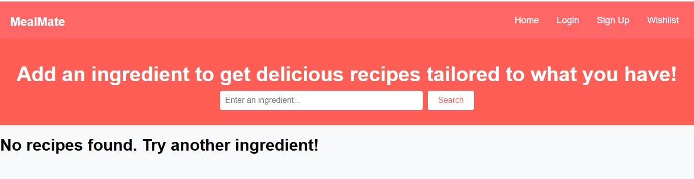
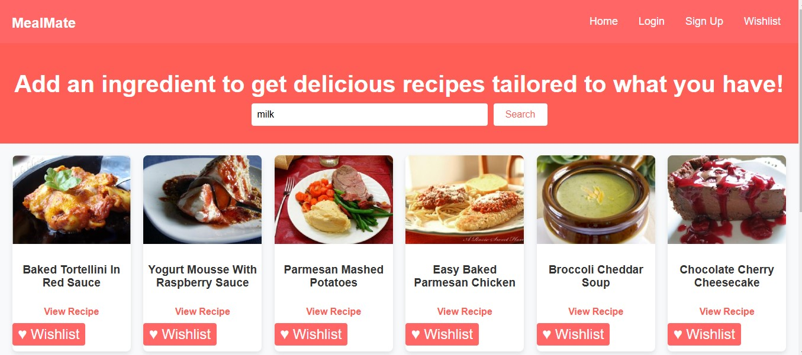
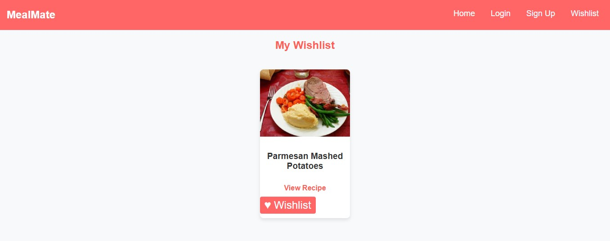

# MealMate

MealMate is a simple web application that helps users find recipes based on the ingredients they have. It fetches recipes from an external API and displays them in an easy-to-navigate interface.

You can connect with me on [LinkedIn](https://www.linkedin.com/in/fatima-amkachou-7a0a53278/).

[Go To MealMate](https://mealmatapp.netlify.app/)

## Features

- <b>Ingredient-Based Search:</b> Enter an ingredient to find recipes.
- <b>Wishlist Functionality:</b> Add your favorite recipes to the wishlist for quick access later.
- <b>Recipe Gallery: </b>View a collection of recipes with images and titles.
- <b>Quick Links: </b>Access detailed instructions for each recipe.
- <b>Responsive Design:</b> Works well on desktops, tablets, and mobile devic

## Technologies Used

- <b>React.js:</b> A JavaScript library for building user interfaces, handling routing and navigation between different pages like Home, Login, Signup, and Wishlist.
- <b>HTML:</b> For structuring the web page.
- <b>CSS: </b>For styling the application.
- <b>JavaScript (ES6+):</b> For implementing interactive functionality, such as ingredient-based search, adding to the wishlist, and dynamic content updates.
- <b>JavaScript:</b> For adding interactivity and fetching data from the API.
- <b>API:</b> Spoonacular API (or other recipe APIs) for fetching recipe data.
- <b>Netlify:</b> A platform for hosting and deploying the app, providing continuous deployment from GitHub.

## How to Run

### Clone the repository
`git clone https://github.com/FTFati/MealMate-Webstack-Portfolio-Project.git`

### Navigate to the project directory
`cd mealmate`

### Install Dependencies
`npm install`

### Run the Development Server
`npm start`

### Open your browser and go to http://localhost:3000 to start using the MealMate app locally.

## API Setup

Sign up for a free API key from Spoonacular API.

Open api.js and replace your_api_key_here with your actual API key:

const API_KEY = 'your_api_key_here';

## Hosting

You can host this project for free using platforms like:

Netlify: https://www.netlify.com

Vercel: https://vercel.com

## Contributing

Feel free to fork this repository, make changes, and submit a pull request. Suggestions and improvements are always welcome!

## License

This project is open-source and available under the MIT License.

## Authors
[Fatima Amkachou](https://github.com/FTFati): Full Stack Developer, Project Manager
